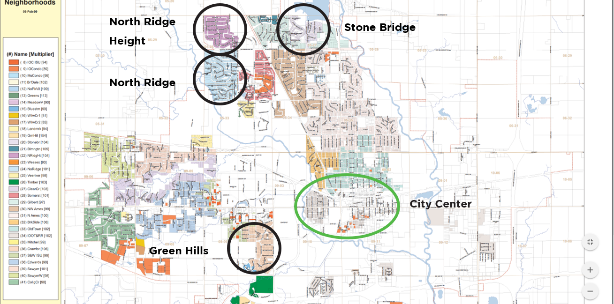

# Project 2 - Ames Housing Data and Kaggle Challenge

## Problem Statement

To build a regression model with the lowest error to predict Sales Price of houses sold in Ames

## Objective
 1) Read 'train.csv' to clean and organise data 
 
 2) Create a regression model based on the Ames Housing Dataser to predict the price of a house at sales in Ames, IA using train-test split
 
 3) Predict Sales Price using predictor values given in 'test.csv' to generate unknown data
 
 
 ## Executive Summary

### Contents:

- [Data Preparation](#1.Data-Preparation)
- [One Hot Encoding](#2.One-Hot-Encoding-for-Categorical-Variables)
- [Feature Engineering](#3.Features-Engineering-with-Lasso)
- [Model Pre-Work](#4.Preparing-Data-For-Modelling-Selections)
- [Train/Test Spilt](#5.Model-Prep:-Train/Test-Split)
- [Instantiation](#6.Model-Prep:-Instantiate-models)
- [Model Selection](#7.Model-Selection)
- [Prediction](#8.Prediction)
- [Summary](#9.Summary)

## Data Dictionary

Refer to the [data description](http://jse.amstat.org/v19n3/decock/DataDocumentation.txt).

## Model Deployed For Selection

 1) Linear Regression
 
 2) Ridge Regression
 
 3) Lasso Regression
 
 4) Elastic Net
 
 
## Summary
 
Lasso Regression (Lasso) Model is chosen for the modelling of the Ames Housing data, for the prediction of Sale Price. The model is able to achieve a R2 score of 0.887, which means it covers 88.7% of the data. And a RMSE value of **31260** based on Kaggle submission. 

30 features were used for the LR model:

Based on the coefficient, Total SF is the most significant variables that will affect the house price, followed by Overall Quality and Kitchen Quality, which makes sense. 1 square feet increase in the house area will increase the price by close to USD 40,000. 

Also, we can observe that the top 4 neighbourhood that will increase the price positively are North Ridge Height, Stone Bridge, Green Hills and North Ridge. 

Further research proved the model right as seen from the map above. Green Hills are a stone throw away from Iowa University and relatively close to Ames city center. North Ridge, North Ridge Height and Stone Bridge are within the upper class neighbourhood in Ames, with closeby malls, neighborhood center, parks and even a golf course (A sport for rich people!). 

We can also possibly deduce where the other richer and poorer neighbourhood in AMES based on whether the neighbourhood has + or - coefficient on Sale Price. 

In summary, we can conclude that the LR model for the AMES housing dataset has addressed the problem statement of estimating Sale Price of AMES houses with lowest possible error.
